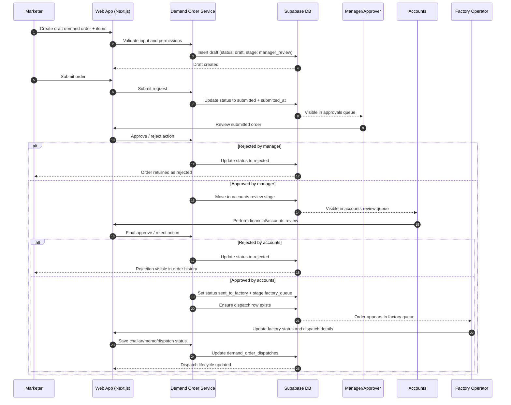
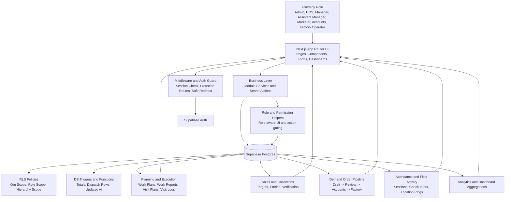

# Sales Master Web App

<p align="center">
  <b>Role-based Sales Operations and Field Force Management Platform</b><br/>
  Plan, execute, track, approve, dispatch, and analyze sales operations in one system.
</p>

<p align="center">
  
  
  
  
  
</p>

---

## Table of Contents

- [Overview](#overview)
- [Business Problem It Solves](#business-problem-it-solves)
- [Core Features](#core-features)
- [Role and Permission Model](#role-and-permission-model)
- [Operational Workflow](#operational-workflow)
- [Project Modules](#project-modules)
- [Tech Stack](#tech-stack)
- [Architecture at a Glance](#architecture-at-a-glance)
- [Database and Security](#database-and-security)
- [Getting Started](#getting-started)
- [Environment Variables](#environment-variables)
- [Available Scripts](#available-scripts)
- [Deployment Notes](#deployment-notes)
- [Recommended README Enhancements](#recommended-readme-enhancements)
- [Contribution](#contribution)
- [License](#license)

---

## Overview

**Sales Master Web App** is an operational platform for organizations with field sales teams and internal approval pipelines.

It combines:

- User hierarchy and role-based access
- Daily field operations (attendance and location activity)
- Sales and collection execution
- Demand order review and accounts approval
- Factory queue and dispatch lifecycle
- Dashboard and analytics for management visibility

The system is designed so different business roles see different data and actions based on hierarchy and responsibility.

---

## Business Problem It Solves

Many sales organizations manage operations across multiple disconnected tools (spreadsheets, chats, calls, manual logs). This causes:

- No single source of truth for sales, collection, and order status
- Slow approval cycles and weak traceability
- Limited visibility into team attendance and field activity
- Delays between order approval and factory dispatch

This app solves those problems by centralizing complete sales operations in one secure, role-aware platform.

---

## Core Features

### 1) Role-based Dashboard

- Personalized KPI cards per role
- Quick widgets for high-priority actions
- Recent activities, recent orders, and report summaries

### 2) User, Organization, and Hierarchy Management

- Organization and branch-aware user structure
- Role hierarchy (admin to field-level roles)
- Reporting lines (`reports_to_user_id`) and subordinate visibility

### 3) Planning and Execution Modules

- Work plans and work reports
- Visit plans and visit logs
- Party and product master data

### 4) Sales and Collection Operations

- Sales targets and collection targets
- Sales entries and collection entries
- Collection verification support for accounts/admin flows

### 5) Demand Order Pipeline

- Draft creation with line items
- Submit and multi-level review
- Accounts review checkpoints
- Approval log timeline and action tracking

### 6) Factory Queue and Dispatch

- Factory queue visibility for authorized roles
- Dispatch updates (challan, memo, status transitions)
- Demand-order-to-dispatch linkage

### 7) Attendance and Field Activity

- Check-in/check-out attendance sessions
- One active check-in session per user (enforced)
- Geo-location pings during active sessions
- Field activity summary for management monitoring

### 8) Operational Analytics

- Sales and collection trends
- Target vs actual comparison
- Attendance summary
- Order pipeline summary by stage/status

---

## Role and Permission Model

The app currently uses the following application roles:

- `admin`
- `hos` (Head of Sales)
- `manager`
- `assistant_manager`
- `marketer`
- `accounts`
- `factory_operator`

### High-Level Access Pattern

- **Admin**: Full organization-level control and management visibility
- **HOS/Manager/Assistant Manager**: Team-level monitoring and approvals via hierarchy scope
- **Marketer**: Own operational actions (plans, reports, entries, order creation, attendance)
- **Accounts**: Financial verification and accounts review flows
- **Factory Operator**: Factory queue and dispatch execution

---

## Operational Workflow

Typical lifecycle for a field-to-factory cycle:

1. User checks in via attendance
2. Field activity is captured with location pings
3. Sales and collection entries are recorded
4. Demand orders are created and submitted
5. Manager-level approval moves orders through review stages
6. Accounts review validates financial checkpoints
7. Approved orders enter factory queue
8. Factory operator updates dispatch and delivery status
9. Dashboard and analytics reflect end-to-end progress

### Demand Order Approval Flow (Sequence Diagram)



---

## Project Modules

> Routes are under `src/app/(app)` and domain logic lives in `src/modules/*`.

### Main App Areas

- `dashboard`
- `profile`
- `users`
- `parties`
- `products`
- `work-plans`
- `work-reports`
- `visit-plans`
- `visit-logs`
- `sales-targets`
- `collection-targets`
- `sales-entries`
- `collection-entries`
- `demand-orders`
- `approvals`
- `accounts-review`
- `factory-queue`
- `attendance`
- `field-activity`
- `analytics`

---

## Tech Stack

### Frontend

- Next.js 16 (App Router)
- React 19
- TypeScript
- Tailwind CSS 4
- Lucide icons
- React Hook Form + Zod for schema-based validation

### Backend / Data Layer

- Supabase Auth
- Supabase Postgres
- Supabase SSR integration
- SQL migrations for schema evolution
- Row Level Security (RLS) policies for access control

---

## Architecture at a Glance

- **App Router pages** handle route-level rendering and access checks.
- **Module services/actions** encapsulate business logic and data queries.
- **Supabase middleware** enforces session-based protected route behavior.
- **Role helpers** centralize UI and action-level permission checks.
- **SQL migration layer** defines schema, constraints, triggers, and RLS.

### Architecture Diagram



---

## Database and Security

This project uses a security-first approach:

- Organization-scoped data model
- Role and hierarchy-aware RLS policies
- Trigger-backed integrity for calculated values (for example, order totals)
- Controlled transitions for attendance, approvals, and dispatch lifecycle

Important migration groups include:

- Auth, organization, roles, and hierarchy foundations
- Parties and products modules
- Plans/logs/reports modules
- Sales and collection modules
- Demand orders and approval logs
- Accounts review and factory dispatch
- Attendance sessions and location pings

---

## Getting Started

### Prerequisites

- Node.js 20+ (recommended)
- npm (or pnpm/yarn/bun)
- Supabase project (for database + auth)

### Installation

```bash
git clone <your-repository-url>
cd sales-master-webapp
npm install
```

### Start Development Server

```bash
npm run dev
```

Open [http://localhost:3000](http://localhost:3000) in your browser.

---

## Environment Variables

Create a `.env.local` file in the project root and configure:

```env
NEXT_PUBLIC_SUPABASE_URL=your_supabase_project_url
NEXT_PUBLIC_SUPABASE_PUBLISHABLE_KEY=your_supabase_publishable_key
# Optional fallback key naming in project codebase:
NEXT_PUBLIC_SUPABASE_ANON_KEY=your_supabase_anon_key
SUPABASE_SERVICE_ROLE_KEY=your_supabase_service_role_key
# Optional: protect public health endpoint in production
HEALTHCHECK_TOKEN=your_private_healthcheck_token
```

> Note: At least `NEXT_PUBLIC_SUPABASE_URL` and one publishable/anon key must be set for auth/session flows. Server-side admin/provisioning flows require `SUPABASE_SERVICE_ROLE_KEY`.

---

## Available Scripts

- `npm run dev` - Start development server
- `npm run build` - Build production bundle
- `npm run start` - Run production server
- `npm run lint` - Run ESLint checks

---

## Deployment Notes

- Ensure all required Supabase migrations are applied before production run.
- Validate RLS policies with real role test accounts.
- Configure environment variables in your deployment platform.
- If you set `HEALTHCHECK_TOKEN`, configure your monitor to send `Authorization: Bearer <token>` (or `?token=`) to `/api/health`.
- Run `npm run build` to verify production compatibility.

---

## Recommended README Enhancements

To make this README even stronger for public/open-source visibility, add:

- Screenshots/GIFs of dashboard, approvals, analytics, and factory queue
- ERD or architecture diagram
- Sample seed data and demo role credentials (if safe)
- API contract references (if REST endpoints expand)
- Changelog and release notes

---

## Contribution

1. Create a feature branch
2. Make focused changes with clear commit messages
3. Run lint and local verification
4. Open a pull request with:
   - context/problem statement
   - solution summary
   - test steps

---

## License

This project currently has no explicit license declared in the repository.
Add a `LICENSE` file (for example MIT, Apache-2.0, or proprietary) based on your distribution model.
